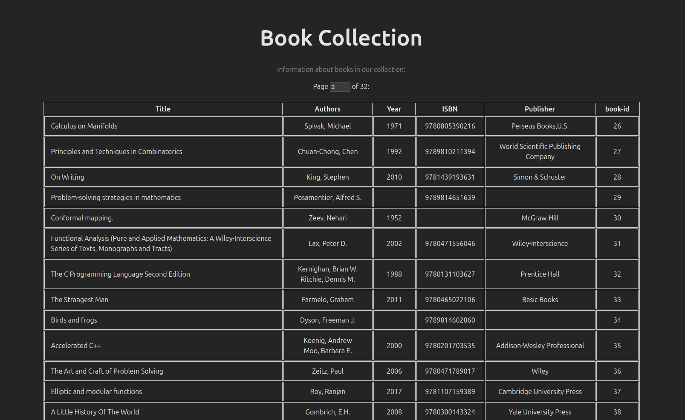

# CLZ Book Data App

I use CLZ books to keep track of my paper books collection.
This is an app to read the data in the CLZ library export XML
file and work with it in various ways. It is partly
for my own use, because I like the CLZ mobile app for cataloging
books, and partly an exercise to try out different software
technologies and designs. It is ongoing and evolving, and I look
forward to seeing what I can make from it.

## Rust Parser

The `src` folder has a Rust program that
extracts data from the CLZ data XML file and inserts the data into the
database. It uses `quick_xml` for the low level parsing: Specifically we use
the start and end tags and text contained within tags that it finds. Then
we implement a state machine that allows us to extract only the data we're
interested in extracting while ignoring other fields.

We use `sqlx` to connect to and insert into the database.
We have two worker threads -- one for the parser and one for the database --
and channels between these and the main thread, which manages the work and
handles console output. This allows some work to be done concurrently,
but it also helps give the program a simpler and clearer structure.

See [parser/README](parser/README.md) for more notes on
the evolving design of this program. Here are the [parser](parser/lib/parse.rs) and [database](parser/lib/database.rs) modules.

## Database and Docker Compose

The Docker Compose app has services for the database, the Deno web server,
and the gRPC Golang database utility. This is configured in [compose.yaml](./compose.yaml).

**To start the database and web app:**

In the project root, assuming you have Docker installed, run

```shell
docker compose up
```

You can add the `--build` flag to force Docker to rebuild the container images,
and add `mariadb` to start only the database service.

The first time you run this it will create an empty `collection` database.

**Setting up / resetting the database:**

The `dbutil` folder has a SQL script to dump all data and reset the
schema, and a Go console program to run these commands or import
a database dump. You can also run these commands using the TUI described
below.

See [dbutil/README](dbutil/README.md) for more detailed instructions on
resetting the database and updating the schema and more notes on our
Docker Compose setup.

## Deno + React Web App

We have a basic React web app served by Deno to display the book data.
The server has a JSON endpoint that serves book record data from our database, and
the React frontend client uses data from that endpoint to generate a React Table
component displaying book record information.
See [webapp/README](webapp/README.md) for more information on these.



## gRPC Microservice Architecture

I've implemented the Golang database
utility as a gRPC service that can be called by the TUI or by other services.
I've also started implementing a Rust gRPC serivce for the XML file parser,
so it can be run interactively through the TUI.
This will allow the user to provide input on which records from the parser
should be added to the database. In the future it can be used to help find and merge
overlapping records.

Using gRPC opens up some interesting possibilities. For example
we could run the database service and web app on a Raspberry Pi server so that
it's always available. Or I may eventually host this app using a cloud service,
at which point gRPC communication between services would be very useful.

Another idea is to add services for creating, managing,
and restoring database dumps as checkpoints when updating the collection data.
More details on the Go gRPC server are [here](dbutil/README.md#grpc-server).
The Rust gRPC server implementation is in `parser_grpc`.

## Bubbletea TUI

I've added a basic TUI using the Golang
[Bubbletea](https://github.com/charmbracelet/bubbletea) framework. It currently
provides a utility to reset the database data and schema, and
I've recently added a feature to provide a user interface to the parser, using
the Rust gRPC service to stream book records found while parsing.
The TUI can display these records to the user and request feedback
on before inserting them into the database.

More details on the TUI are in [tui/README](tui/README.md).
There are many more useful things we can do with it.

## Kubernetes Deployment

I'd eventually like to deploy this using a cloud service, in order to test
and develop in that environment. For that, it will be useful to set the app
up to run in Kubernetes. To start working towards that, I've added a Kubernetes
deployment of the Deno + React web app in the [k8s](./k8s/) directory, and have
included instructions on how to set it up and run it locally in Minikube.
See [k8s/README](./k8s/README.md) for the instructions.

## Next

We will continue adding more fields to the book data we extract from
the XML file and store into the database. We will also keep
working on finding more useful ways to view and modify the data.
And, we will keep working on adding more features of the app to the
Kubernetes deployment.

## Sources

I've gotten help and inspiration from various sources while working
on this. I'll try to cite some of those I drew the most from [here](Credits.md).
