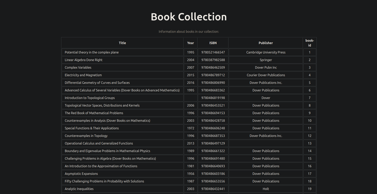

# CLZ Book Data App

I use CLZ books to keep track of my paper books collection.
This is an app to read the data in the CLZ library export XML
file and work with it in various ways. It is WIP. This is partly
for my own use, because I like the CLZ mobile app for cataloging
books, and partly an excuse to try out some nice software
development tools.

## Rust Parser

The `src` folder has a Rust program that
extracts data from the CLZ data XML file and inserts the data into the
database. It uses `quick_xml` for the low level parsing -- specifically we use
the start and end tags and text contained within tags that it finds. Then
we have a state machine that allows us to extract only the data we're
interested in extracting while ignoring other fields.

We use `sqlx` to connect to and insert into the database.
We have two worker threads -- one for the parser and one for the database --
and channels between these and the main thread, which manages the work and
handles console output. This allows some work to be done concurrently,
but it also helps give the program a simpler and clearer structure.

See [parser/README](parser/README.md) for more notes on
the evolving design of this program.

## Database and Docker Compose

**To start the database and web app:**

In the project root, assuming you have Docker installed, run

```shell
docker compose up
```

You can add the `--build` flag to force Docker to rebuild the container images,
and add `mariadb` to start only the database service.

The first time you run this it will create an empty `collection` database.

**Setting up / resetting the database:**

The `dbutil` folder has a SQL script to dump all data and reset the
schema, and a little Go program to connect to the database and run it.

See that folder's [README](dbutil/README.md) for instructions on
resetting the database and updating the schema and notes on our
Docker Compose setup.

## Deno Web App

We now have a basic React web app served by Deno to display the book data.
It has a JSON endpoint that serves book record data from our database and
a frontend client that uses that to generate a React Table component displaying
the book information. See [webapp/README](webapp/README.md) for more information.



## gRPC Microservice Architecture

We've currently implemented the Golang database
utility as a gRPC microservice that can be called remotely with various
commands from our future TUI. We may also make our Rust XML import program
run as a gRPC service, so it can be run interactively through the TUI.
Then the user can provide input to help avoid adding duplicate data
and for merging data from overlapping records.

Using gRPC opens up some interesting possibilities. For example
we could run the database service and web app on a Raspberry Pi server so
it's always available. Another idea is to add services for creating, managing,
and restoring database dumps as checkpoints when updating the collection data.
More details are [here](dbutil/README.md).

## Bubbletea TUI

We've added a Golang TUI using the
[Bubbletea](https://github.com/charmbracelet/bubbletea) framework!
What we have now is a basic utility to reset the database data and
schema, but there's so much more we can do with this.
More ideas are mentioned in [parser/README](parser/README.md).

I've added a component to this to start handling the parser interface and
have written a Rust gRPC server to send book records found while parsing.
More details on these things are in [tui/README](tui/README.md).
Currently the TUI just uses a mock parser for testing, but soon I'll hook
it up to the Rust gRPC service.

## Next

We will continue adding more fields to the book data we extract from
the XML file and insert into the database. We will also keep
working on finding more useful ways to view and modify the data.

## Sources

I've gotten help and inspiration from various sources while working
on this. I'll try to cite some of those I drew the most from [here](Credits.md).
